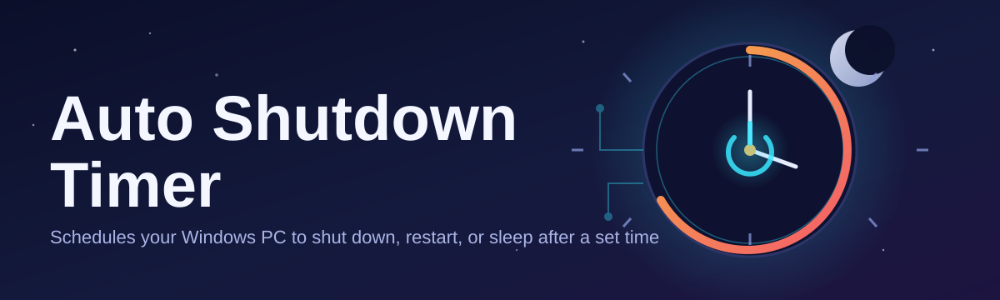
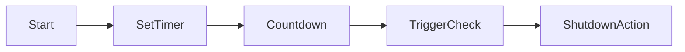

# auto-shutdown-timer-controller ⏻⏰

  

*Set it, forget it, and let your PC punch the clock without you.*

---

### ⏱️ Before / After

| | Manual Shutdown Habit | auto-shutdown-timer-controller |
|---|---|---|
| **Downloads left running overnight** | PC idles for hours, burns power | Timer kills it the second the job's done |
| **Falling asleep mid-movie** | Laptop runs till morning | Sleep-timer shuts down at credits |
| **Remembering to shut down** | Relies on your memory (unreliable) | Countdown does it for you, every time |
| **Killing power at LAN parties / rentals** | Awkward manual reminders | Scheduled auto-shutdown, zero babysitting |
| **Setup complexity** | Task Scheduler + CLI flags | One window, one slider, done |

---

## 🧭 Overview

**auto-shutdown-timer-controller** is a lightweight Windows utility that turns the ancient `shutdown /s /t` command into something you'd actually enjoy using. Instead of memorizing command-line flags or digging through Task Scheduler's maze of tabs, you get a single clean window: pick a duration or an exact clock time, hit start, and walk away. The auto shutdown timer counts down quietly in the background and powers off, restarts, sleeps, or hibernates your machine exactly when you told it to.

This exists because "I'll just remember to turn it off" is a lie we all tell ourselves. Renders that run for hours, torrents that finish at 3 AM, kids who fall asleep with the tablet still charging, offices that need machines dark after hours for energy compliance — the auto shutdown timer software space is full of half-finished scripts and ad-choked freeware. This project is neither. It's a single-purpose tool that does one job with precision and gets out of your way.

Built for gamers who nap mid-download, IT admins enforcing shutdown schedules across shared machines, students working in library computer labs, and anyone who's ever left a laptop running for no reason — this is the shutdown scheduler you install once and trust forever.

  

---

## 🔥 What Makes It Tick

- **Countdown Precision** — set shutdown timers down to the second, not "roughly in an hour." Milliseconds matter when you're timing a render's final frame.

- **Multi-Action Engine** — shutdown, restart, sleep, hibernate, or log off. One timer, five possible endings, your choice.

- **Absolute vs Relative Timing** — schedule "shutdown in 90 minutes" or "shutdown at 23:45 sharp." The auto shutdown timer supports both modes natively.

- **Cancel Anytime, No Penalty** — one click aborts the countdown. No hidden state, no zombie scheduled tasks lingering in the background.

- **Silent Tray Operation** — minimizes to the system tray and stays invisible until it matters, showing only a quiet countdown tooltip.

- **Recurring Schedules** — set it once for "every night at midnight" and stop thinking about it entirely.

- **Process-Aware Triggers** *(beta)* — auto-shutdown-timer-controller can watch for a specific app to close (like a download client or render job) and fire the shutdown only then.

- **Zero Telemetry** — no accounts, no phone-home pings, no analytics riding shotgun on your shutdown schedule.

> [!TIP]
> Combine **Recurring Schedules** with **Process-Aware Triggers** to build a "shutdown after backup finishes, every Friday" routine without touching a script editor.

---

## 🚀 Getting Started

1. Visit the landing page via the **GET** button above.

2. Download the standalone executable — no installer wizard, no bundled toolbars.

3. Run it. Windows SmartScreen may flag it as unrecognized on first launch — click **More Info → Run Anyway**.

4. Pick your countdown, pick your action, hit **Start Timer**. Done.

> [!NOTE]
> No account creation, no license key, no internet connection required after download. The auto shutdown timer runs 100% offline.

---

## 💻 System Requirements

   

<strong>Full requirements breakdown</strong>

| Requirement | Spec |
|---|---|
| OS | Windows 10 (64-bit) or Windows 11 |
| RAM | 50MB idle footprint — negligible |
| Disk | Under 10MB, no install directory sprawl |
| .NET / Runtime | Self-contained, nothing to pre-install |
| Permissions | Standard user; admin only needed for forced shutdown of other users' sessions |
| Internet | None required post-download |

---

## ⚙️ How It Works

<strong>Architecture & shutdown workflow</strong>

The controller is built around a minimal, deterministic loop — no background services, no registry sprawl, no scheduled-task pollution.

1. **Input Capture** — you set a duration, absolute time, or trigger condition.

2. **Countdown Engine** — a lightweight internal clock ticks down and updates the tray/UI display every second.

3. **Trigger Check** — on zero (or on the watched condition firing), the engine hands off to the Windows shutdown API.

4. **Action Dispatch** — shutdown, restart, sleep, hibernate, or logoff executes via native Windows calls, not a fragile shell script.

5. **Clean Exit** — the app closes its own state cleanly, leaving nothing behind to trigger on next boot.

> [!IMPORTANT]
> Unsaved work is *your* responsibility. The auto shutdown timer does not auto-save open documents — pair it with your app's own autosave feature.

---

## 🧩 Troubleshooting

<strong>Common questions, answered directly</strong>

**Q: My PC didn't shut down at the set time — what happened?**
A: Check for pending Windows Updates or another process blocking shutdown (a modal dialog, unsaved file prompt). The auto shutdown timer requests shutdown but Windows itself can still delay it.

**Q: Can I cancel a countdown after it starts?**
A: Yes — one click on **Cancel** in the tray icon or main window aborts it instantly, no residual scheduled task left behind.

**Q: Does this work with Sleep or Hibernate instead of full shutdown?**
A: Yes, both are supported as end actions, selectable from the same countdown screen.

**Q: SmartScreen flagged the download — is that normal?**
A: Yes. Unsigned indie tools commonly trigger this warning. It disappears as download counts grow; click **Run Anyway** to proceed.

**Q: Will a scheduled shutdown fire during an active download or render?**
A: If you're on a duration timer, yes — it fires regardless. Use **Process-Aware Triggers** to wait for the process to finish first.

**Q: Does it conflict with Windows' own sleep/screensaver settings?**
A: No — the app runs independently on top of your existing power plan and doesn't modify system-level power settings.

---

## 🎨 UI / UX Details

- **Keyboard shortcuts**: `Ctrl+S` start timer · `Ctrl+X` cancel · `Ctrl+M` minimize to tray · `Esc` close dialog

- **Themes**: Light, Dark, and a true black "Midnight" mode for late-night sessions

- **Tray countdown**: hover the tray icon to see remaining time without opening the window

- **Sound cues**: optional audio warning at 60s and 10s remaining — toggle in Settings

- **Persistent last settings**: reopens with your last-used duration and action pre-filled

> [!TIP]
> Use **Midnight theme** if you're setting a sleep timer right before bed — your eyes will thank you.

---

## 🤝 Contributing & Community

Bug reports, feature requests, and pull requests are welcome. This project stays sharp because people who actually use an auto shutdown timer daily tell us what's broken.

- Open an issue with clear repro steps for bugs

- Propose features via issue first — keeps effort aligned before code is written

- PRs should stay scoped: one feature or fix per pull request

> [!WARNING]
> Please don't submit PRs that add telemetry, ads, or bundled installers. This tool stays lean by design — that's non-negotiable.

---

## 📜 License

Released under the [MIT License](LICENSE), 2026. Use it, fork it, ship it inside your own tools — just keep the license notice intact.

---

## ⚠️ Disclaimer

This software forcibly closes your session, applications, and OS state per your configuration. **Save your work before the countdown ends.** The maintainers are not responsible for data loss from unsaved documents, interrupted downloads, or third-party software that doesn't handle shutdown signals gracefully. Use the auto shutdown timer responsibly on shared or production machines.

---

  

